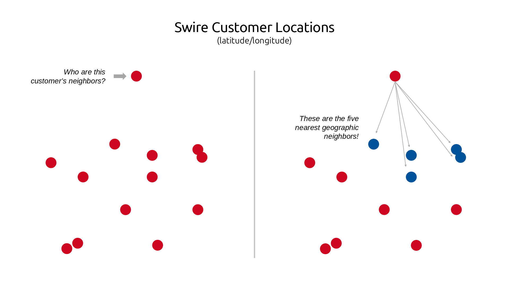

<br>

# Business Problem Statement

Regional beverage bottler Swire Coca-Cola (SCCU) relies on two business models: 1) “Red Truck”, which features high-volume customers serviced personally by Swire, and 2) “White Truck” or “Alternate Route to Market”, which entails smaller customers serviced by a third-party distributor.

Swire’s current segmenting strategy has led to misallocation of resources, inflated expenses, and missed opportunities from clients with high-growth potential. Swire aims to better algin their customers with the business proposition of these models by identifying customer characteristics and  rdering behavior that better determines the right business model for the long-term relationship.

# Modeling  Introduction


In approach #2, Adam will explore an different approach to clustering, one that leverages Principal Component Analysis and two different algorithms: kmeans and hierarchical. The goal is to identify unique customer groupings that could identify those that are 1) definitely red truck, 2) definitely white truck, and 3) it depends.


# Data Preparation

### Approach to Wrangling

The dataset undergoes aggregation, merging, and transformation to optimize it for PAM clustering with Gower’s Distance and Random Forest classification.

First, key numerical and categorical features are selected, with categorical variables encoded and missing values imputed ("999" for categorical, median values for numerical). Data is aggregated at the customer-year level, calculating total and average order values, and deriving customer tenure from the difference between the latest transaction date and first recorded delivery. To maintain consistency, a mode function (get_mode) is applied to categorical variables such as trade channel, sub-trade channel, order type, and local market partner status, ensuring representative values for each customer. The resulting dataset, customer_full_summary, merges customer transaction summaries with these aggregated categorical features.

To incorporate local market dynamics, customer_full_summary is merged with customer_neighbor_fields, adding neighbor-based attributes such as average order transactions, return frequency, primary group distribution, and geospatial attributes (latitude, longitude, zip code). These additional features enhance segmentation and predictive modeling by capturing regional purchasing patterns.

Additionally, a Local Market Partner (LMP) subset is created by filtering customers who purchase only fountain drinks while excluding CO2, cans, and bottles (local_market_partner = 1 and co2_customer = 0). This segmentation allows for a more targeted analysis of smaller, high-frequency purchasers.

To further optimize the dataset, all data is converted into an efficient data.table format for faster querying and merging. A stratified sample of 2,000 customer-year pairs ensures balanced representation across different customer segments. These enhancements ensure that both PAM clustering and Random Forest classification operate on clean, structured, and feature-rich data, improving customer segmentation and high-value order prediction across all customer groups, including Local Market Partners.


### Libraries & Data

We begin by setting up our session with the necessary libraries and data provided by Swire. These will be referenced often throughout this document.

```{r warning = FALSE, message = FALSE}

# Load libraries for EDA
library('tidyverse')  # Data wrangling & visualization
library('gt')         # Create professional tables
library('janitor')    # Clean column names & messy data
library('psych')      # Descriptive stats & psych research tools
library('stringr')    # String manipulation
library('lubridate')  # Handle dates & times
library('rmarkdown')  # Render R Markdown docs
library('dplyr')      # Data manipulation (filter, select, mutate, etc.)
library('skimr')      # Quick summary stats
library('tidyr')      # Reshape/tidy data
library('readxl')     # Read Excel files
library('ggplot2')    # Data visualization
library('readr')      # Read/write CSV & text files
library('knitr')      # Generate dynamic reports
library('leaflet')    # Generate dynamic map
library('dbscan')      # Density-based clustering
library('dendextend')  # Extends dendrogram functionality
library('caret')       # Machine learning and model training
library('Matrix')      # Sparse and dense matrix operations
library('parallel')    # Parallel computing
library('glmnet')      # Lasso and ridge regression
library('xgboost')     # Gradient boosting machine learning
library('randomForest')# Random forest classifier
library('fastDummies') # One-hot encoding for categorical variables
library('ROSE')        # Oversampling and undersampling for imbalanced data
library('smotefamily') # SMOTE for class imbalance
library('cluster')     # Clustering algorithms
library('factoextra')  # Extract and visualize clustering results
library('data.table')  # Fast data manipulation
library('FNN')         # Fast nearest neighbors
library('kableExtra')  # Enhancements for tables in Markdown/HTML reportslibrary(Cairo)
library('Cairo')       # Ensures sharper, more professional-looking graphics in Markdown/HTML reports and printed documents
library('geosphere')
library("tidymodels") # Used for its modeling framework
library("tidyclust")  # Used for clustering approaches
library("kernlab")    # Weighted kernal k-means)
library('tibble')
```

```{r eval = FALSE}
# Read files into session
transactions <- as.data.frame(data.table::fread("data/transactional_data.csv"))
customer_address <- read.csv("data/customer_address_and_zip_mapping.csv")
customer_profile <- read.csv("data/customer_profile.csv")
delivery_cost <- readxl::read_xlsx('data/delivery_cost_data.xlsx')
customer_neighbors_clean <- as.data.frame(data.table::fread("data/customer_neighbor_fields.csv")) |>
  mutate(customer_number = as.character(customer_number))

# Ensure a writable directory
dir.create("plots", showWarnings = FALSE)
knitr::opts_chunk$set(fig.path = "plots/", dev = "png")

# If on a headless system
knitr::opts_chunk$set(dev = "CairoPNG")

# Close any open graphics devices
graphics.off()
```

```{r include = FALSE}

# Branding colors
swire_colors <- list(
  "red" = "#cd0720", 
  "blue" = "#005398", 
  "gray" = "#f2f2f2"
)

# {ggplot2} theme for Swire
theme_swire <- function() {
    theme(
    plot.title.position = "plot", 

    plot.background = element_rect(fill = "white", color = NA), 
    panel.background = element_rect(fill = swire_colors$gray, color = NA), 

    plot.title = element_text(color = swire_colors$red, face = "bold", family = "Poppins"), 
    plot.subtitle = element_text(face = "italic", family = "Poppins"), 
    axis.title = element_text(face = "bold", family = "Poppins"), 
    axis.text = element_text(family = "Poppins"), 

    strip.background = element_rect(fill = swire_colors$blue, color = NA), 
    strip.text = element_text(color = "white", face = "bold")
  )
}
```


### Prepping the Cost Data

```{r eval = FALSE}
delivery_cost_expanded <- 
    delivery_cost |>
    # Split the volume range into an object
    mutate(
        range_obj = purrr::map(`Vol Range`, str_split, " - ")
    ) |>
    # Unnest the object for individual reference
    unnest(range_obj) |>
    unnest_wider(range_obj, names_sep = "_") |>
    # Handle the "1350+" scenario
    mutate(
        min_vol = purrr::map_chr(range_obj_1, str_replace, "\\+", ""), 
        max_vol  = ifelse(is.na(range_obj_2), (2^31) - 1, range_obj_2)
    ) |>
    # Turn volumes from charaters to integers
    mutate(
        across(min_vol:max_vol, as.integer)
    ) |>
    # Drop irrelevant columns
    select(-c(range_obj_1, range_obj_2, `Vol Range`))
```

```{r eval = FALSE}
annual_cust_volume <-
    # Take transaction level data
    transactions |>
    # Bring in the customer profile for the `Cold Drink Channel`
    inner_join(
        customer_profile, 
        join_by(CUSTOMER_NUMBER)
    ) |>
    # Get annual cases/gallons by customer
    group_by(YEAR, CUSTOMER_NUMBER, COLD_DRINK_CHANNEL) |>
    summarise(
        annual_cases = sum(DELIVERED_CASES), 
        annual_gallons = sum(DELIVERED_GALLONS), 
        .groups = "drop"
    )
```

```{r eval = FALSE}
delivery_cost_tiers <-
    annual_cust_volume |>
    left_join(
        delivery_cost_expanded |> filter(`Applicable To` != 'Fountain'), 
        join_by(COLD_DRINK_CHANNEL == `Cold Drink Channel`, annual_cases >= min_vol, annual_cases <= max_vol)
    ) |>
    left_join(
        delivery_cost_expanded |> filter(`Applicable To` == 'Fountain'), 
        join_by(COLD_DRINK_CHANNEL == `Cold Drink Channel`, annual_gallons >= min_vol, annual_gallons <= max_vol), 
        suffix = c(".c", ".g")
    ) |>
    select(
        YEAR, CUSTOMER_NUMBER, 
        case_delivery_cost = `Median Delivery Cost.c`, 
        gallon_delivery_cost = `Median Delivery Cost.g`
    )

# Take a peek
head(delivery_cost_tiers)
```


### Prep the Customer Address Object

```{r eval = FALSE}
cust_addr_expanded <-
    customer_address |>
    # Split the full address into an object
    mutate(
        addr_obj = purrr::map(full.address, str_split, ",")
    ) |>
    # Unnest the object for individual reference
    unnest(addr_obj) |>
    unnest_wider(addr_obj, names_sep = "_") |>
    # Pad the zip code with leading zeros and make a character
    mutate(
        zip = str_pad(zip, 5, "left", pad = "0")
    ) |>
    # Rename columns
    rename(
        city = addr_obj_2, 
        state = addr_obj_3, 
        state_abbr = addr_obj_4, 
        county = addr_obj_5, 
        lat = addr_obj_7, 
        lon = addr_obj_8
    ) |>
    # Turn lat/lon values to numeric
    mutate(
        across(lat:lon, as.numeric)
    ) |>
    # Drop irrelevant columns
    select(-c(full.address, addr_obj_1, addr_obj_6))
```


### Combine Individual Files

```{r eval = FALSE}
combined_data_raw <-
    # Take transactions
    transactions |>
    # Join the customer profile data thereto
    inner_join(
        customer_profile |> mutate(zip = str_pad(
            ZIP_CODE, 5, "left", "0"
        )), 
        join_by(CUSTOMER_NUMBER)
    ) |>
    # Join the customer address data thereto
    inner_join(
        cust_addr_expanded, 
        join_by(zip)
    ) |>
    # Join the delivery cost tiers data thereto
    inner_join(
        delivery_cost_tiers, 
        join_by(YEAR, CUSTOMER_NUMBER)
    )
```


### Standardize Names & Data Types

```{r eval = FALSE}
combined_data_std <- 
    # Take the combined data from above
    combined_data_raw |>
    # Standardize the names
    clean_names() |>
    # Standardize data types
    mutate(
        # Convert charater dates to date types
        across(c(transaction_date, first_delivery_date, on_boarding_date), lubridate::mdy), 
        # Turn IDs into characters
        across(c(customer_number, primary_group_number), as.character), 
        # Turn finite categorical fields into factors
        across(
            c(order_type, cold_drink_channel, frequent_order_type, trade_channel, sub_trade_channel, state, state_abbr), 
            as.factor
        )
    ) |>
    # Remove irrelevant columns
    select(-c(zip_code))
```


### Enrich Dataset with New Fields

```{r eval = FALSE}
swire_data_full <-
    combined_data_std |>
    # Add new fields
    mutate(
        # Calculate delivered gallons cost
        # Assume a return is only half as costly as a normal delivery
        delivered_gallons_cost = case_when(
            delivered_gallons < 0 ~ -1 * delivered_gallons * gallon_delivery_cost / 2, 
            TRUE ~ delivered_gallons * gallon_delivery_cost
        ), 
        # Calculate delivered case cost
        # Assume a return is only half as costly as a normal delivery
        delivered_cases_cost = case_when(
            delivered_cases < 0 ~ -1 * delivered_cases * case_delivery_cost / 2, 
            TRUE ~ delivered_cases * case_delivery_cost
        ),
        # Create 'total' columns representing the sum of gallons & cases
        ordered_total = ordered_gallons + ordered_cases, 
        loaded_total = loaded_gallons + loaded_cases, 
        delivered_total = delivered_gallons + delivered_cases, 
    ) |>
    group_by(year, primary_group_number) |>
    mutate(
        # Calculate number of customers belonging to each primary group by year
        primary_group_customers = ifelse(is.na(primary_group_number), 0, n_distinct(customer_number))
    ) |>
    group_by(year, customer_number) |>
    mutate(
        # Calculate how often a customer issues a return each year
        return_frequency = sum(ifelse(delivered_cases < 0 | delivered_gallons < 0, 1, 0))
    ) |>
    ungroup() |>
    # Drop select columns that are no longer relevant
    select(-c(gallon_delivery_cost, case_delivery_cost)) |>
    # Order the columns logically
    select(
        # CUSTOMER PROFILE ITEMS
        customer_number, primary_group_number, primary_group_customers, 
        on_boarding_date, first_delivery_date, cold_drink_channel, frequent_order_type, trade_channel, sub_trade_channel, local_market_partner, co2_customer, city, zip, state, state_abbr, county, lat, lon, 
        
        # TRANSACTION DETAILS
        transaction_date, week, year, order_type, 
        ordered_cases, loaded_cases, delivered_cases, delivered_cases_cost, 
        ordered_gallons, loaded_gallons, delivered_gallons, delivered_gallons_cost, 
        ordered_total, loaded_total, delivered_total, 
        return_frequency
    )
```

### Final Data Set

```{r include = FALSE}

swire_data_full <- readRDS('data/swire_data_full.Rds')
```

```{r}
glimpse(swire_data_full)
```

Now, we have a single, standardized data set that is enriched, properly formatted, and well-suited to the remaining analysis.

## Modeling - Approach 1

### Additional Data Preparation

####A ggregate Customer Order Data by Year

```{r Aggregating Customer Order Data by Year}

# Aggregate data by customer_number and year
customer_order_summary_by_year <- swire_data_full %>%
  group_by(customer_number, year) %>%
  summarise(
    combined_ordered_total = sum(ordered_total, na.rm = TRUE),
    average_order = mean(ordered_total, na.rm = TRUE)
  ) %>%
  ungroup()

# Check structure of the dataset
str(customer_order_summary_by_year)

```

#### Create Comprehensive Customer Dataset 

Aggregate and Merge swire_data_full, customer_order_summary_by_year, swire_data_mode, swire_data_selected, and customer_neighbor_fields to create customer_full_summary

```{r Aggregated Dataset }

# Function to get the most common (mode) value for categorical fields
get_mode <- function(x) {
  x <- na.omit(x) # Remove NAs
  if(length(x) == 0) return(NA) # Return NA if empty
  unique_x <- unique(x)
  unique_x[which.max(tabulate(match(x, unique_x)))]
}

# Aggregate swire_data_full to find the most common value for each categorical feature per customer
swire_data_mode <- swire_data_full %>%
  group_by(customer_number) %>%
  summarise(
    primary_group_number = get_mode(primary_group_number),
    cold_drink_channel = get_mode(cold_drink_channel),
    frequent_order_type = get_mode(frequent_order_type),
    trade_channel = get_mode(trade_channel),
    sub_trade_channel = get_mode(sub_trade_channel),
    local_market_partner = get_mode(local_market_partner),
    co2_customer = get_mode(co2_customer),
    city = get_mode(city),
    state = get_mode(state),
    state_abbr = get_mode(state_abbr),
    county = get_mode(county),
    order_type = get_mode(order_type),
    .groups = "drop"
  )

# Merge with customer_order_summary_by_year
customer_full_summary <- customer_order_summary_by_year %>%
  left_join(swire_data_mode, by = "customer_number")

# Replace NA primary_group_number with "999"
customer_full_summary <- customer_full_summary %>%
  mutate(primary_group_number = ifelse(is.na(primary_group_number), "999", primary_group_number))

# Add a binary column order_over_500
customer_full_summary <- customer_full_summary %>%
  mutate(order_over_500 = ifelse(combined_ordered_total > 500, 1, 0))

# Add a binary column order_under_100
customer_full_summary <- customer_full_summary %>%
  mutate(order_under_100 = ifelse(combined_ordered_total < 100, 1, 0)) 

# Aggregate missing columns to remove duplicates
swire_data_selected <- swire_data_full %>%
  group_by(customer_number) %>%
  summarise(
    primary_group_customers = max(primary_group_customers, na.rm = TRUE),
    on_boarding_date = min(on_boarding_date, na.rm = TRUE),  # Earliest onboarding date
    first_delivery_date = min(first_delivery_date, na.rm = TRUE),  # Earliest delivery date
    zip = get_mode(zip),
    lat = mean(lat, na.rm = TRUE),  # Average latitude
    lon = mean(lon, na.rm = TRUE),  # Average longitude
    transaction_date = max(transaction_date, na.rm = TRUE),  # Latest transaction
    week = get_mode(week),
    return_frequency = mean(return_frequency, na.rm = TRUE),  # Average return frequency
    .groups = "drop"
  )

# Merge deduplicated data with customer_full_summary
customer_full_summary <- customer_full_summary %>%
  left_join(swire_data_selected, by = "customer_number")

customer_full_summary <- customer_full_summary %>%
  mutate(customer_tenure = as.numeric(difftime(transaction_date, first_delivery_date, units = "weeks")) / 52)

# Check structure of the dataset
# str(customer_full_summary)
```

#### Merge Neighbor Dataset 

Merge customer_neighbor_fields to customer_full_summary

```{r ADD customer_neighbor_fields to customer_full_summary}

# Convert data frames to data.tables for efficient merging
customer_full_summary <- as.data.table(customer_full_summary)
customer_neighbor_fields <- as.data.table(customer_neighbor_fields)

# Convert customer_number to character to ensure proper merging
customer_full_summary[, customer_number := as.character(customer_number)]
customer_neighbor_fields[, customer_number := as.character(customer_number)]

# Merge customer_neighbor_fields into customer_full_summary
customer_full_summary <- merge(customer_full_summary, 
                               customer_neighbor_fields, 
                               by = "customer_number", 
                               all.x = TRUE)

# Check structure after merging
#str(customer_full_summary)
```

### Modeling

#### PAM Clustering with Gower’s Distance

```{r PAM Clustering with Gower’s Distance}

# Make a copy of the dataset 
CLARA <- customer_full_summary 

# Select Key Features for CLARA Clustering in R
clustering_data <- CLARA %>%
  select(customer_number, year, primary_group_number, cold_drink_channel, frequent_order_type, trade_channel)

# Preprocess Data for CLARA Clustering - Encoding Categorical Variables
clustering_data <- clustering_data %>%
  mutate(across(where(is.character) & !all_of("customer_number"), as.factor)) %>%  # Exclude customer_number
  mutate(across(where(is.factor), as.numeric))  # Convert factors to numeric encoding


# Impute missing values with column medians (instead of dropping them)
clustering_data <- clustering_data %>%
  mutate(across(where(is.numeric), ~replace_na(., median(., na.rm = TRUE))))

# Set Seed 
set.seed(123)  # Ensure reproducibility

# Convert to data.table for efficient sampling
clustering_data <- as.data.table(clustering_data)

# Make sure `customer_number` is character for correct merging
clustering_data[, customer_number := as.character(customer_number)]

# Sample **2000 unique customer-year pairs** (ensure correct format)
clustering_sample <- clustering_data[, .SD[sample(.N, min(.N, 2000))], by = year]

# Compute Gower’s Distance using daisy() for mixed data clustering
gower_dist <- daisy(clustering_sample %>% select(-customer_number, -year), metric = "gower")

# PAM Clustering with Gower's Distance
set.seed(123)
PAM_result <- pam(gower_dist, k = 9)  # Using PAM instead of CLARA

# Assign clusters to the sampled dataset
clustering_sample$cluster <- as.factor(PAM_result$clustering)

# Convert datasets to data.table for efficient merging
CLARA <- as.data.table(CLARA)
clustering_sample <- as.data.table(clustering_sample)

# Ensure `customer_number` is character in both datasets for merging
CLARA[, customer_number := as.character(customer_number)]
clustering_sample[, customer_number := as.character(customer_number)]

# Merge assigned clusters back into the full dataset
CLARA <- merge(
  CLARA,
  clustering_sample[, .(customer_number, year, cluster)], 
  by = c("customer_number", "year"), 
  all.x = TRUE
)

# Assign missing clusters using Nearest Neighbor Matching (KNN)
missing_customers <- CLARA[is.na(cluster), ]
non_missing_customers <- CLARA[!is.na(cluster), ]

if (nrow(non_missing_customers) > 0 & nrow(missing_customers) > 0) {
  knn_result <- knn(
    train = non_missing_customers %>% select(combined_ordered_total, average_order, return_frequency, customer_tenure),
    test = missing_customers %>% select(combined_ordered_total, average_order, return_frequency, customer_tenure),
    cl = non_missing_customers$cluster,
    k = min(5, nrow(non_missing_customers))  # Prevents errors if fewer than 5 observations
  )
  
  # Assign predicted clusters to missing customers
  CLARA[is.na(cluster), cluster := knn_result]
}

# Compute Cluster Centroids for Missing Cluster Assignment
if (nrow(CLARA[is.na(cluster),]) > 0 & nrow(non_missing_customers) > 0) {
  # Compute cluster centroids
  cluster_centers <- non_missing_customers %>%
    group_by(cluster) %>%
    summarise(across(c(combined_ordered_total, average_order, return_frequency, customer_tenure), mean))

  # Assig Missing Clusters Using Nearest Centroid Matching
  CLARA[is.na(cluster), cluster := apply(
    CLARA[is.na(cluster), .(combined_ordered_total, average_order, return_frequency, customer_tenure)], 
    1, 
    function(x) {
      distances <- apply(cluster_centers[, -1], 1, function(centroid) sum((x - centroid)^2, na.rm = TRUE))
      return(cluster_centers$cluster[which.min(distances)])  # Assign to closest centroid
    }
  )]
}

# Randomly Assigning Missing Clusters from Available Clusters
available_clusters <- unique(CLARA$cluster[!is.na(CLARA$cluster)])

if (length(available_clusters) > 0 & nrow(CLARA[is.na(cluster),]) > 0) {
  CLARA[is.na(cluster), cluster := sample(available_clusters, nrow(CLARA[is.na(cluster),]), replace = TRUE)]
}

# Preform Multidimensional Scaling (MDS) on Gower’s Distance Matrix
mds_data <- cmdscale(as.dist(gower_dist), k = 2)  # Convert Gower’s distance into 2D space

# Create a dataframe for plotting
cluster_plot_data <- as.data.frame(mds_data)
cluster_plot_data$cluster <- PAM_result$clustering  # Assign cluster labels

# Visualize the Clusters
ggplot(cluster_plot_data, aes(V1, V2, color = as.factor(cluster))) +
  geom_point(alpha = 0.7, size = 3) +
  labs(title = "PAM Clustering with Gower’s Distance",
       x = "MDS Dimension 1",
       y = "MDS Dimension 2",
       color = "Cluster") +
  theme_minimal()

# Verify that Every Customer has a Cluster
table(is.na(CLARA$cluster))  # Should return only FALSE

# str(CLARA)
# head(CLARA)
 
 
 # Calculate silhouette scores using Gower's distance and cluster assignments
silhouette_score <- silhouette(PAM_result$clustering, gower_dist)

# Print average silhouette width (higher is better)
cat("Average silhouette width:", mean(silhouette_score[, 3]), "\n")

# Visualize the silhouette plot
plot(silhouette_score, main = "Silhouette Plot for PAM Clustering")

# K = 9
# Average silhouette width: 0.439543
```


$ order_over_500         : num  0 0 1 0 0 0 0 0 1 1 ...
 
 $ primary_group_number   : chr  "999" "999" "999" "999" ...
 $ cold_drink_channel     : Factor w/ 9 levels "ACCOMMODATION",..: 5 5 4 4 6 6 5 5 4 4 ...
 $ frequent_order_type    : Factor w/ 6 levels "CALL CENTER",..: 6 6 5 5 1 1 5 5 5 5 ...
 $ trade_channel          : Factor w/ 26 levels "ACADEMIC INSTITUTION",..: 18 18 8 8 23 23 18 18 15 15 ...
 $ sub_trade_channel      : Factor w/ 48 levels "ASIAN FAST FOOD",..: 36 36 42 42 29 29 36 36 34 34 ...
 $ local_market_partner   : logi  TRUE TRUE TRUE TRUE TRUE TRUE ...
 $ co2_customer           : logi  TRUE TRUE TRUE TRUE FALSE FALSE ...
 $ city                   : chr  "Marysville" "Marysville" "Cecilton" "Cecilton" ...
 $ order_type             : Factor w/ 7 levels "CALL CENTER",..: 7 7 3 3 1 1 1 1 3 3 ...
 $ primary_group_customers: num  0 0 0 0 11 11 0 0 0 0 ...
 $ return_frequency       : num  0.773 0.773 0 0 0 ...
 $ customer_tenure        : num  6.7 6.7 6.48 6.48 1.79 ...
 $ cluster                : Factor w/ 4 levels "1","2","3","4": 1 1 1 1 3 3 1 1 2 1 ..
 
 
 
 $ average_order          : num  13.7 22.6 13.1 28.4 3.5 ...
 $ combined_ordered_total : num  370 383.5 591.5 482 17.5 ...
 $ customer_number        : chr  "500245678" "500245678" "500245685" "500245685" ...

#### ALL Customers: SMOTE-enhanced Random Forest model with hyperparamter tuning Over 500

```{r smote_rf_tuning, echo=FALSE}

# Convert categorical variables to factors
categorical_vars <- c("primary_group_number", "cold_drink_channel", "frequent_order_type",
                      "trade_channel", "sub_trade_channel", "order_type", "cluster")

CLARA[, (categorical_vars) := lapply(.SD, as.factor), .SDcols = categorical_vars]

# Convert logical variables to numeric (TRUE/FALSE -> 1/0)
CLARA[, local_market_partner := as.numeric(local_market_partner)]
CLARA[, co2_customer := as.numeric(co2_customer)]

# Handle high-cardinality categorical features by integer encoding
for (col in categorical_vars) {
  if (nlevels(CLARA[[col]]) > 53) {
    CLARA[[col]] <- as.integer(as.factor(CLARA[[col]]))  # Convert to numeric encoding
  }
}

features <- c("primary_group_number", "cold_drink_channel", "frequent_order_type",
              "trade_channel", "sub_trade_channel", "local_market_partner",
              "co2_customer", "order_type", "primary_group_customers",
              "return_frequency", "customer_tenure", "cluster", 
              "neighbor_avg_dist_km", "neighbor_primary_group_count", "neighbor_local_market_partners", "neighbor_avg_return_freq",
              "neighbor_avg_order_transactions_2024", "neighbor_avg_order_transaction_std_2024", "neighbor_avg_ordered_total_2024")

# Prepare dataset
df <- CLARA[, c(features, "order_over_500"), with = FALSE]
df$order_over_500 <- as.factor(df$order_over_500)  # Convert target to factor

# Split dataset into train and test sets
set.seed(42)
trainIndex <- createDataPartition(df$order_over_500, p = 0.8, list = FALSE)
train_data <- df[trainIndex, ]
test_data <- df[-trainIndex, ]

# Apply SMOTE using the ROSE package
train_data_balanced <- ovun.sample(order_over_500 ~ ., data = train_data, method = "over", p = 0.5, seed = 42)$data

# Hyperparameter tuning using tuneRF()
set.seed(42)
best_mtry <- tuneRF(train_data_balanced[, -which(names(train_data_balanced) == "order_over_500")], 
                    train_data_balanced$order_over_500, 
                    stepFactor = 1.5, improve = 0.01, trace = TRUE)

# Select best mtry value
optimal_mtry <- best_mtry[which.min(best_mtry[, 2]), 1]
cat("Optimal mtry value:", optimal_mtry, "\n")

# Train Optimized Random Forest Model
set.seed(42)
rf_model <- randomForest(order_over_500 ~ ., data = train_data_balanced, 
                         ntree = 200,  # Increased trees for better accuracy
                         mtry = optimal_mtry, 
                         importance = TRUE)


# Predictions on test data
predictions <- predict(rf_model, test_data)

# Model Evaluation
conf_matrix <- confusionMatrix(predictions, test_data$order_over_500)
print(conf_matrix)

# Feature Importance
importance(rf_model)
varImpPlot(rf_model)

# When the model predicts 1, it is correct about 76.8% of the time.
# Accuracy: 88.65%
# Precision: 76.8%
# Specificity/Recall: 72.1% (some false negatives will be missed)
#  F1-score: 74.4%

```

#### Local Market Partners: SMOTE-enhanced Random Forest model with hyperparamter tuning Over 500

```{r lmp_smote_rf_tuning, echo=FALSE}

# Filter CLARA dataset to include only Local Market Partners (LMP)
CLARA_LMP <- CLARA %>%
  filter(local_market_partner == 1 & co2_customer == 0)

# Save the dataset for further analysis
write.csv(CLARA_LMP, "CLARA_LMP.csv", row.names = FALSE)

# Check the structure and preview the dataset
str(CLARA_LMP)
# head(CLARA_LMP)

# Convert categorical variables to factors
categorical_vars <- c("primary_group_number", "cold_drink_channel", "frequent_order_type",
                      "trade_channel", "sub_trade_channel", "order_type", "cluster")

CLARA_LMP[, (categorical_vars) := lapply(.SD, as.factor), .SDcols = categorical_vars]

# Convert logical variables to numeric (TRUE/FALSE -> 1/0)
CLARA_LMP[, local_market_partner := as.numeric(local_market_partner)]
CLARA_LMP[, co2_customer := as.numeric(co2_customer)]

# Handle high-cardinality categorical features by integer encoding
for (col in categorical_vars) {
  if (nlevels(CLARA_LMP[[col]]) > 53) {
    CLARA_LMP[[col]] <- as.integer(as.factor(CLARA_LMP[[col]]))  # Convert to numeric encoding
  }
}

features <- c("primary_group_number", "cold_drink_channel", "frequent_order_type",
              "trade_channel", "sub_trade_channel",# "order_type", "primary_group_customers",
              "return_frequency", "customer_tenure", "cluster", 
              "neighbor_avg_dist_km", "neighbor_primary_group_count", "neighbor_local_market_partners", "neighbor_avg_return_freq",
              "neighbor_avg_order_transactions_2024", "neighbor_avg_order_transaction_std_2024", "neighbor_avg_ordered_total_2024")

# Prepare dataset
df <- CLARA_LMP[, c(features, "order_over_500"), with = FALSE]
df$order_over_500 <- as.factor(df$order_over_500)  # Convert target to factor

# Split dataset into train and test sets
set.seed(42)
trainIndex <- createDataPartition(df$order_over_500, p = 0.8, list = FALSE)
train_data <- df[trainIndex, ]
test_data <- df[-trainIndex, ]

# Apply SMOTE using the ROSE package
train_data_balanced <- ovun.sample(order_over_500 ~ ., data = train_data, method = "over", p = 0.5, seed = 42)$data

# Hyperparameter tuning using tuneRF()
set.seed(42)
best_mtry <- tuneRF(train_data_balanced[, -which(names(train_data_balanced) == "order_over_500")], 
                    train_data_balanced$order_over_500, 
                    stepFactor = 1.5, improve = 0.01, trace = TRUE)

# Select best mtry value
optimal_mtry <- best_mtry[which.min(best_mtry[, 2]), 1]
cat("Optimal mtry value:", optimal_mtry, "\n")

# Train Optimized Random Forest Model
set.seed(42)
rf_model <- randomForest(order_over_500 ~ ., data = train_data_balanced, 
                         ntree = 200,  # Increased trees for better accuracy
                         mtry = optimal_mtry, 
                         importance = TRUE)


# Predictions on test data
predictions <- predict(rf_model, test_data)

# Model Evaluation
conf_matrix <- confusionMatrix(predictions, test_data$order_over_500)
print(conf_matrix)

# Feature Importance
importance(rf_model)
varImpPlot(rf_model)
```

## Modeling Approaches

### Approach 1

**Clustering with PAM and Gower’s Distance**

Customers are segmented based on purchasing behavior and attributes to enhance predictive modeling. Key numerical and categorical variables are selected, categorical features are encoded, and missing values are imputed using medians. Since the dataset includes mixed data types, Gower’s Distance is computed to measure similarity, followed by PAM clustering to create nine clusters (k = 9). Customers outside the initial 2,000 sampled dataset are assigned clusters using K-Nearest Neighbors (KNN), centroid matching, or random assignment. Cluster quality is assessed using Multidimensional Scaling (MDS) and Silhouette Scores (Avg. Silhouette Width = 0.44), confirming meaningful segmentation..

**Predicting High-Value Orders with Random Forest**

The second stage involves predicting high-value orders (order_over_500) using Random Forest, incorporating transaction history, customer attributes, clustering results, and neighbor-based features. The dataset is split 80/20 into training and testing sets, and SMOTE (Synthetic Minority Oversampling) from the ROSE package is applied to balance the dataset. Hyperparameter tuning (tuneRF()) optimizes the mtry value to 6, ensuring the best number of features for each split.

A separate model is developed for Local Market Partners (LMPs) to analyze order behaviors among customers who purchase only fountain drinks, excluding CO2, cans, and bottles. This targeted segmentation enhances the relevance of predictive modeling for different customer groups.


### Approach 2

This approach is another take on clustering. The idea is to enrich the data with additional features, most notably leveraging the spatial data we have to understand "neighboring" customers of swire. Here's a simple graphic to illustrate the idea:



For each customer, it may be helpful to know how isolated or densely populated they are. We can approximate this using the "Haversine Distance" formula. In short, it utilizes the latitude and longitude, adjusting for eath's curvature, to approximate the "as the crow flies" distance.

Knowing which 5 customers are closest to each, we can determine order volume, return rates, etc., for these neighbors. **These fields could be helpful in determining the value of an area**; if an area is valuable, even if the customer isn't *yet*, there may be a statistical argument for their potential for red truck.

Let's derive these distances.

#### Customer Level of Detail

We want to get the data to one customer per row. Since we're currently at the level of detail of transactions, we need to do some prep work.

```{r}
swire_cust_grp <-
    swire_data_full |>
    group_by(
        pick(customer_number:lon, return_frequency, year),
    ) |>
    summarise(
        order_transactions = sum(ifelse(ordered_total > 0, 1, 0)), 
        order_transaction_std = sd(ordered_total), 
        delivery_transactions = sum(ifelse(delivered_total > 0, 1, 0)), 
        across(ordered_cases:delivered_total, ~ sum(.x))
    ) |>
    ungroup()
```

```{r}
swire_cust_uniq <- 
    swire_cust_grp |>
    pivot_wider(
        id_cols = c(customer_number:primary_group_number, on_boarding_date:lon), 
        names_from = year, 
        values_from = c(primary_group_customers, return_frequency:delivered_total), 
        names_glue = "{.value}_{year}", 
        values_fill = 0
    )
    
swire_cust_clean <- 
    swire_cust_uniq |>
    replace_na(list(
        order_transaction_std_2023 = mean(swire_cust_uniq$order_transaction_std_2023, na.rm = TRUE), 
        order_transaction_std_2024 = mean(swire_cust_uniq$order_transaction_std_2024, na.rm = TRUE), 
        delivered_gallons_cost_2023 = 0, 
        delivered_gallons_cost_2024 = 0, 
        delivered_cases_cost_2023 = 0,
        delivered_cases_cost_2024 = 0

    )) |>
    select(-c(city, zip, state_abbr, county))
```


#### Distance Calculations

```{r eval = FALSE}
if(file.exists('data/cust_dist.rda')) {
    load('data/cust_dist.rda')
} else {
    kansas.data <- swire_cust_grp |> filter(state == 'Kansas')
    kansas.dist <- distm(kansas.data[,c("lon", "lat")], fun = distHaversine)

    mass.data <- swire_cust_grp |> filter(state == 'Massachusetts')
    mass.dist <- distm(mass.data[,c("lon", "lat")], fun = distHaversine)

    maryland.data <- swire_cust_grp |> filter(state == 'Maryland')
    maryland.dist <- distm(maryland.data[,c("lon", "lat")], fun = distHaversine)

    kentucky.data <- swire_cust_grp |> filter(state == 'Kentucky')
    kentucky.dist <- distm(kentucky.data[,c("lon", "lat")], fun = distHaversine)

    louisiana.data <- swire_cust_grp |> filter(state == 'Louisiana')
    louisiana.dist <- distm(louisiana.data[,c("lon", "lat")], fun = distHaversine)

    cust_dist <- list(
        "louisiana" = list(
            "dist" = louisiana.dist, 
            "cust" = louisiana.data$customer_number, 
            "group" = louisiana.data$primary_group_number
        ), 
        "kansas" = list(
            "dist" = kansas.dist, 
            "cust" = kansas.data$customer_number, 
            "group" = kansas.data$primary_group_number
        ), 
        "mass" = list(
            "dist" = mass.dist, 
            "cust" = mass.data$customer_number, 
            "group" = mass.data$primary_group_number
        ), 
        "maryland" = list(
            "dist" = maryland.dist, 
            "cust" = maryland.data$customer_number, 
            "group" = maryland.data$primary_group_number
        ), 
        "kentucky" = list(
            "dist" = kentucky.dist, 
            "cust" = kentucky.data$customer_number, 
            "group" = kentucky.data$primary_group_number
        )
    )

    save(cust_dist, file = "data/cust_dist.rda")
}
```

```{r eval = FALSE}
diag(cust_dist$louisiana$dist) <- Inf
diag(cust_dist$kansas$dist) <- Inf
diag(cust_dist$mass$dist) <- Inf
diag(cust_dist$maryland$dist) <- Inf
diag(cust_dist$kentucky$dist) <- Inf
```

```{r eval = FALSE}
get_top5 <- function(row) {
    idx <- order(setdiff(row, c(0)))[1:5]
    values <- row[idx] / 1000
    list(indices = idx, values = values)
}
```


```{r eval = FALSE}
dist_df <- data.frame(matrix(NA, nrow = 0, ncol = 4)) |>
    mutate(
        X1 = as.character(X1),
        X2 = as.character(X2),
        X3 = as.integer(X3),
        X4 = as.numeric(X4)
    )
colnames(dist_df) <- c("customer_number", "primary_group_number", "indices", "distances")

for(state in names(cust_dist)) {
    results <- apply(cust_dist[[state]]$dist, 1, get_top5)

    results_tbl <- tibble(
        customer_number = as.character(cust_dist[[state]]$cust), 
        primary_group_number = as.character(cust_dist[[state]]$group), 
        indices = lapply(results, function(x) x$indices),
        distances = lapply(results, function(x) x$values)
    ) |>
        unnest_longer(c("indices", "distances")) |>
        inner_join(
            tibble(
                neighbor_number = as.character(cust_dist[[state]]$cust)
            ) |> rowid_to_column()
            , join_by(indices == rowid)
        )

    dist_df <- bind_rows(dist_df, results_tbl)
}
```


#### Intersecting With Customers

Now that we have generated the "neighbors" for each customer, we can join back to our cleaned customer data and calculate summary values for all of the neighbors.

```{r eval = FALSE}
customer_neighbors <- dist_df |>
    as_tibble() |>
    inner_join(
        swire_cust_clean, 
        join_by(neighbor_number == customer_number)
    ) |>
    mutate(
        same_group_flg = primary_group_number.x == primary_group_number.y
    ) |>
    group_by(
        customer_number
    ) |>
    summarise(
        neighbor_avg_dist_km = mean(distances), 
        neighbor_primary_group_count = sum(same_group_flg, na.rm = TRUE), 
        neighbor_local_market_partners = sum(local_market_partner), 
        neighbor_avg_return_freq = (mean(return_frequency_2023) + mean(return_frequency_2024)) / 2, 
        neighbor_avg_order_transactions_2023 = mean(order_transactions_2023),  
        neighbor_avg_order_transactions_2024 = mean(order_transactions_2024), 
        neighbor_avg_order_transaction_std_2023 = mean(order_transaction_std_2023), 
        neighbor_avg_order_transaction_std_2024 = mean(order_transaction_std_2024), 
        neighbor_avg_ordered_total_2023 = mean(ordered_total_2023), 
        neighbor_avg_ordered_total_2024 = mean(ordered_total_2024)
    ) |>
    ungroup()

customer_neighbors_clean <- 
    customer_neighbors |>
    mutate(neighbor_avg_dist_km = ifelse(
        is.infinite(neighbor_avg_dist_km), 
        max(ifelse(!is.infinite(neighbor_avg_dist_km), neighbor_avg_dist_km, NA), na.rm = TRUE), 
        neighbor_avg_dist_km
    )) |>
    replace_na(list(
        neighbor_avg_dist_km = median(customer_neighbors$neighbor_avg_dist_km, na.rm = TRUE), 
        neighbor_avg_order_transaction_std_2023 = mean(customer_neighbors$neighbor_avg_order_transaction_std_2023, na.rm = TRUE), 
        neighbor_avg_order_transaction_std_2024 = mean(customer_neighbors$neighbor_avg_order_transaction_std_2024, na.rm = TRUE)
    ))
```


#### Enriching Additional Values

We now gave great summary values for the neighbors of each customer. Let's now get our full customer level of detail data together and finalize some data enrichment:

```{r}
swire_cust_enriched <- 
    swire_cust_clean |>
    inner_join(customer_neighbors_clean) |>
    mutate(
        across(c(on_boarding_date, first_delivery_date), as.Date), 
        across(c(customer_number, primary_group_number), as.character), 
        across(c(co2_customer, local_market_partner), as.integer), 
        customer_tenure_yrs = round(as.integer(lubridate::ymd("2024-12-31") - on_boarding_date) / 365.25, 1), 
        ramp_up_mon = round(as.integer(first_delivery_date - on_boarding_date) * 12 / 365.25, 1)
    ) |>
    select(-c(on_boarding_date, first_delivery_date))
```

We now have a really feature rich dataset with additional features describing the area and neighboring customers. 

```{r}
glimpse(swire_cust_enriched)
```


#### Prep for Clustering

We need to turn categorical data into one-hot encoded (dummy) variables so we can run PCA.

```{r}
swire_numeric <- swire_cust_enriched |> select(where(is.numeric))
swire_non_numeric <- swire_cust_enriched |> 
    select(!where(is.numeric)) |>
    select(-c(customer_number, primary_group_number, sub_trade_channel)) |>
    mutate(
        across(everything(), ~factor(make.names(.)))
    )
```

```{r}
swire_dmy <- dummyVars("~ .", swire_non_numeric)
data_dmy <- data.frame(predict(swire_dmy, swire_non_numeric))
```


```{r}
swire_cust_combined <-
    swire_numeric |>
    bind_cols(data_dmy) |>
    select(-c(trade_channel.PHARMACY.RETAILER))
```

Let's now scale these values:

```{r}
swire_scaled <- scale(swire_cust_combined)
```

Let's run PCA and get a sense for how well it does:

```{r}
swire_pca <- prcomp(swire_scaled)
```

```{r}
summary(swire_pca)
```

With only 33 principal components, we're capturing 80% of the variability. This is probably sufficient for us to proceed.

```{r}
swire_pca_results <- as.data.frame(swire_pca$x)
```


#### Clustering Algorithm Setup

We're going to try two different algorithms: `kmeans` and `hierarchical` clustering. We'll setup two functions that will calculate the within sum of squares (`wss`).

```{r eval = FALSE}
cluster_kmeans <- function(k, data) {
    fit <- kmeans(data, k)
    vals <- glance(fit)
    return(vals$tot.withinss)
}

cluster_hclust <- function(k, data) {
    # Run the algorithm
    model <- hier_clust(num_clusters = k, linkage_method = "complete")
    fit <- model |> fit(~., data = as.data.frame(data))

    wss <- fit |>
        sse_within() |>
        select(wss) |>
        unlist() |>
        sum()
    return(wss)
}
```

Let's setup a grid where we can save different values for these algorithms against different cluster sizes (2-8) and WSS values:

```{r eval = FALSE}
set.seed(814)

swire_pca_80 <- swire_pca_results[,1:33]
swire_pca_80_sampl <- swire_pca_80 |> sample_n(size = 5000)

clustering_grid <- data.frame(
    clusters = 2:8
)
```

We've also taken a sample of the data for computational efficiency. Let's use a function to plot the outcomes:

```{r eval = FALSE}
show_cluster_results <- function(results, title) {
    results |>
        pivot_longer(cols = -clusters) |>
        unnest(value) |>
        ggplot(aes(
            factor(clusters), 
            as.numeric(value),
            group = name)
        ) +
        geom_line(
            color = swire_colors$red, 
            linetype = "dotted", 
            size = 2
        ) +
        # geom_line(aes(color = name), group = 1) +
        geom_smooth(aes(group = name),, color = swire_colors$red, se = FALSE) +
        labs(
            title = title
            , subtitle = "Two clustering algorithm methods: kmeans and hierarchical"
            , x = "Number of clusters"
            , y = "Within Sum of Squares"
        ) +
        facet_wrap(~name, ncol = 1, scales = "free") +
        # coord_fixed() +
        theme_swire()
}
```

#### Clustering Exploration

```{r eval = FALSE}
clustering_grid_results_sampl_80 <-
    clustering_grid |>
    mutate(
        kmeans = map(clusters, ~ cluster_kmeans(.x, swire_pca_80_sampl))
        ,hclust = map(clusters, ~ cluster_hclust(.x, swire_pca_80_sampl))
    )
```

```{r eval = FALSE}
show_cluster_results(
    clustering_grid_results_sampl_80
    , "Cluster Results | 80% PCA, 5K Sample"
)
```


This graph gives us a sense for the "elbow point", the crux where we get diminishing returns in WSS from splitting into more and more clusters.

That looks to be about 5 (CONFIRM). We could double check that pretty easily by running the above functions again but for all of the data:

```{r eval = FALSE}
clustering_grid_results_80 <-
    clustering_grid |>
    mutate(
        kmeans = map(clusters, ~ cluster_kmeans(.x, swire_pca_80))
        ,hclust = map(clusters, ~ cluster_hclust(.x, swire_pca_80))
    )
```

```{r eval = FALSE}
show_cluster_results(
    clustering_grid_results_80
    , "Cluster Results | 80% PCA, All Data"
)
```

Let's generate cluster assignments!


#### Cluster Assignments

```{r eval = FALSE}
model <- hier_clust(num_clusters = 5, linkage_method = "complete")
fit <- model |> fit(~., data = swire_pca_80)

# Next this
cluster_assignments <- fit |> predict(swire_pca_80)
```

```{r include = FALSE}
# saveRDS(cluster_assignments, file = "data/cluster_assignments.rds")

cluster_assignments <- readRDS("data/cluster_assignments.rds")
```

Now let's join those cluster assignments back to our original, enriched data set. This will allow us to explore the properties of each cluster.

```{r}
swire_cust_clustered <- swire_cust_enriched |> mutate(cluster = cluster_assignments$.pred_cluster)
```


#### Cluster Evaluation

Now, let's evaluate the results, starting with how many customers are in each cluster:

```{r}
swire_cust_clustered |>
  group_by(cluster) |>
  count()
```

We can do a lot more, like describe the unique attributes of each. For now, this is all we have time for.


### Insights

We've learned a few things through this exercise:

1. We can derive a lot of additional insight from this data through some advanced techniques. The Haversine Distance applied to the five nearest customers yielded a lot of features that serve as a proxy for describing the area (i.e. density of customers, demand for products, etc)

2. PCA was quite performant; there was a lot of redundant features telling a similar story. We captured 80% of the variance in just 33 of 95 principal components. That saves a lot of processing power and makes our clustering work more meaningful

3. The clustering algorithms we explored suggest 5 unique clusters as having a fair balance of generalizing the customers while also making them reasonably distinct. 99% of customers fall into the first cluster, leading to roughly 3 possibilities:

  1. Most customers align with our idea of "Red Truck"; this is highly unlikely. Our EDA showed the 75%tile of customers annual order volume was around the 400 threshold.

  2. Most customers align with our idea of a "White Truck"; this is possible but would frankly be a very powerful, albeit strong, statement. 

  3. Most customers fall into a middle ground that isn't well understood; this would be pretty disappointing as it wouldn't empower Swire to view their business any differently


### Future Improvements

A big part of clustering is learning about what is driving the assignment. In so doing, we'll gain insight about the fields that best describe the cluster. Those insights will help us name the clusters, bringing them to life in a powerful way for viewing the business.

This is the next, crucial step. In its current form, the clusters are meaningless. Despite lacking time to do this piece for this milestone, it's a top priority in the early stages of preparing a presentation.


## Approach 3

```{r, results = "hide", warning=FALSE, message=FALSE}
# Data Cleaning
transactional_df <- transactional_data %>%
  clean_names() %>%
  mutate(transaction_date = ymd(transaction_date),
         customer_number = as.character(customer_number)) %>%
  group_by(customer_number) %>%
  summarise(
    total_ordered_cases = sum(ordered_cases, na.rm = TRUE),
    total_delivered_cases = sum(delivered_cases, na.rm = TRUE),
    net_delivered_cases = sum(ifelse(delivered_cases < 0, 0, delivered_cases), na.rm = TRUE),
    fulfillment_rate = ifelse(total_ordered_cases == 0, NA, net_delivered_cases / total_ordered_cases),
    total_returned_cases = sum(abs(delivered_cases[delivered_cases < 0]), na.rm = TRUE),
    total_ordered_gallons = sum(ordered_gallons, na.rm = TRUE),
    total_delivered_gallons = sum(delivered_gallons, na.rm = TRUE),
    net_delivered_gallons = sum(ifelse(delivered_gallons < 0, 0, delivered_gallons), na.rm = TRUE),
    fulfillment_rate_gallons = ifelse(total_ordered_gallons == 0, NA, net_delivered_gallons / total_ordered_gallons),
    total_returned_gallons = sum(abs(delivered_gallons[delivered_gallons < 0]), na.rm = TRUE)
  ) %>%
  filter(!is.na(fulfillment_rate) & !is.na(fulfillment_rate_gallons))

# Clustering - 4 Clusters
set.seed(123)
clustering_data <- transactional_df %>%
  select(total_ordered_cases, total_delivered_cases, fulfillment_rate, total_ordered_gallons, total_delivered_gallons, fulfillment_rate_gallons) %>%
  scale()

kmeans_model <- kmeans(clustering_data, centers = 4, nstart = 10)
transactional_df$cluster <- kmeans_model$cluster
```

##### Fulfillment Clustering
Data was transformed in the clustering process to determine fulfillment rate for gallons and cases (gallons and cases ordered vs what was delivered). This transactional data was then fitting into a clustering model. For time saving in knitting and processing, optimal clustering process was left off from here but determined to be in the 4 to 5 range. 

After clustering the first time, cluster 4 was removed as that data seemed erroneous and simply a data issue. Then I ran clustering for 5.

Results: 

- Cluster 1 (39 customers) has an abnormally high fulfillment rate (43.07) → Possible data errors or unusual cases.
- Cluster 3 (24,298 customers) is still  broad — this is where we may need further refinement.
- Cluster 4 (128 customers) is a clear middle-tier of high-volume buyers.
- Cluster 5 (8 customers) represents the absolute largest buyers—probably wholesalers or major corporate clients.

```{r}
# Results and Key Takeaways
transactional_df <- transactional_df %>% filter(cluster != 4)
clustering_data <- transactional_df %>% select(-customer_number) %>% scale()
kmeans_model <- kmeans(clustering_data, centers = 5, nstart = 10)
transactional_df$cluster <- kmeans_model$cluster

# Summarize new clusters
transactional_df %>%
  group_by(cluster) %>%
  summarise(
    avg_ordered = mean(total_ordered_cases, na.rm = TRUE),
    avg_delivered = mean(total_delivered_cases, na.rm = TRUE),
    avg_fulfillment_rate = mean(fulfillment_rate, na.rm = TRUE),
    count = n()
  )

# Visualize clusters
fviz_cluster(kmeans_model, data = clustering_data)

# Display results
cluster_summary <- tibble(
  Cluster = c("Cluster 1", "Cluster 2", "Cluster 3", "Cluster 4", "Cluster 5"),
  Avg_Ordered = c(1.92, 186452.9, 978.69, 56778.0, 472528.8),
  Avg_Delivered = c(75.77, 177788.6, 908.96, 53204.9, 455473.8),
  Avg_Fulfillment_Rate = c(43.07, 0.95, 0.96, 0.94, 0.96),
  Count = c(39, 22, 24298, 128, 8),
  Interpretation = c(
    "Very small orders, possibly misclassified or extreme cases",
    "Large volume buyers (high-end distributors)",
    "Typical small/medium business buyers",
    "Medium-volume corporate buyers",
    "Elite large buyers (possibly wholesalers)"
  )
)
print(kable(cluster_summary, caption = "Cluster Summary Table"))
```


#### Clustered Fulfillment Rate Summary
### Extract Gallons and Cases Customers from Cluster Three for Summary
```{r, results = "hide", warning=FALSE, message=FALSE}
# Extract Gallons and Cases Customers from Cluster Three

cluster_3_customers <- transactional_df %>% filter(cluster == 3)

cluster_3_cases <- cluster_3_customers %>%
  select(customer_number, total_ordered_cases, total_delivered_cases, fulfillment_rate, total_returned_cases) %>%
  filter(!is.na(fulfillment_rate)) %>%
  arrange(desc(fulfillment_rate))

cluster_3_gallons <- cluster_3_customers %>%
  select(customer_number, total_ordered_gallons, total_delivered_gallons, fulfillment_rate_gallons, total_returned_gallons) %>%
  filter(!is.na(fulfillment_rate_gallons)) %>%
  arrange(desc(fulfillment_rate_gallons))

print(head(cluster_3_cases))
print(head(cluster_3_gallons))

```


### Approach 4
##### Forecasting Data Preparation

Since XGBoost requires numerical values, all categorical variables were turned into factors so they could be encoded later. Columns I thought were unnecessary were removed to simplify the dataset. To help the model recognize patterns, several new features were added. Date-based features like week, month, and quarter were created to help capture seasonal trends. Lag features (lag_1, lag_4, lag_6) were added to give the model information about recent orders, helping it detect short-term changes. Rolling averages (rolling_avg_3 and rolling_avg_6) were included to smooth out order patterns and reduce noise, and a growth_rate feature was added to measure customer momentum by comparing recent orders to past orders. To better predict behavior for different customer types, a new_customer flag was created to separate new customers from established ones to help the model handle each group’s unique behaviors.

```{r}
data <- as.data.table(swire_data_full)
neighbors <- data.table::fread("/data/customer_neighbor_fields.csv")
                           
# convert character variables to factor
cols <- names(data)[sapply(data, is.character)]
data[cols] <- lapply(data[cols], as.factor)

# remove primary group number
data <- subset(data, select = -primary_group_number)

# add a "week" and "month" column
data$transaction_week <- floor_date(data$transaction_date, unit = "week")
data$transaction_month <- floor_date(data$transaction_date, unit = "month")

# convert to data table
setDT(data)

# join neighbors data
data <- data[neighbors, on = "customer_number"]

# aggregate to weekly transactions by customer for all customers
df_grouped_week <- data[, .(
  weekly_ordered_total   = sum(ordered_total, na.rm=TRUE),
  weekly_delivered_total = sum(delivered_total, na.rm=TRUE)#,
  #weekly_return_freq     = sum(return_frequency, na.rm=TRUE)
), by = .(transaction_week, customer_number)]

# subset data
features <- data[, .(customer_number, on_boarding_date, first_delivery_date, cold_drink_channel, frequent_order_type, trade_channel, sub_trade_channel, neighbor_avg_dist_km, neighbor_primary_group_count, neighbor_avg_return_freq, neighbor_local_market_partners, neighbor_avg_order_transactions_2023, neighbor_avg_order_transactions_2024, neighbor_avg_order_transaction_std_2023, neighbor_avg_order_transaction_std_2024, neighbor_avg_ordered_total_2023, neighbor_avg_ordered_total_2024)]

# get unique features
features <- unique(features)

# create a full set of weeks for each customer - all customers
date_seq_all <- df_grouped_week[, .(transaction_week = seq(min(transaction_week),
                                                   max(transaction_week), 
                                                   by = "week")), 
                        by = customer_number]

# merge back with original data
df_grouped_week <- merge(date_seq_all, df_grouped_week, 
                     by = c("customer_number", "transaction_week"), 
                     all.x = TRUE)

# fill missing weeks with zero orders
df_grouped_week[is.na(weekly_ordered_total), weekly_ordered_total := 0]
df_grouped_week[is.na(weekly_delivered_total), weekly_delivered_total := 0]
#df_grouped_week[is.na(weekly_return_freq), weekly_return_freq := 0]

# join the rest of the variables for all customers 
df_grouped_week <- merge(df_grouped_week, features, by = "customer_number", all = TRUE)
```

##### Feature Engineering
```{r}
# newer vs. existing customers using first delivery date
# new vs. existing cutoff
cutoff_date <- as.IDate("2023-07-01")

# create a logical flag
df_grouped_week[, new_customer := (first_delivery_date >= cutoff_date)]

# add date-based features
df_grouped_week[, month := month(transaction_week)]
df_grouped_week[, quarter := quarter(transaction_week)]

# sort to chronological order
setorder(df_grouped_week, customer_number, transaction_week)

# add Lag Features
df_grouped_week[, lag_1 := shift(weekly_ordered_total, 1), by = customer_number]
df_grouped_week[, lag_4 := shift(weekly_ordered_total, 4), by = customer_number]
df_grouped_week[, lag_6 := shift(weekly_ordered_total, 6), by = customer_number]

# add Rolling Averages
df_grouped_week[, rolling_avg_3 := frollmean(weekly_ordered_total, 3), by = customer_number]
df_grouped_week[, rolling_avg_6 := frollmean(weekly_ordered_total, 6), by = customer_number]

# time since onboarding
df_grouped_week[, time_since_onboarding_weeks := 
  as.numeric(difftime(transaction_week, on_boarding_date, units = "weeks"))]
df_grouped_week[time_since_onboarding_weeks < 0, time_since_onboarding_weeks := 0]

# growth rate calculation
df_grouped_week[, growth_rate := (weekly_ordered_total - shift(weekly_ordered_total, 4)) / 
                                      shift(weekly_ordered_total, 4), by = customer_number]

# replace infinite or NA values with zero
df_grouped_week[is.infinite(growth_rate) | is.na(growth_rate), growth_rate := 0]
```


##### Create train and test data - Older Customers
```{r}
# split data based on time
train <- df_grouped_week[new_customer == FALSE & transaction_week < "2024-7-1"]
test  <- df_grouped_week[new_customer == FALSE & transaction_week >= "2024-7-1"]

y_train <- train$weekly_ordered_total
y_test <- test$weekly_ordered_total

train[, week_of_year := week(transaction_week)]
train[, month := month(transaction_week)]
train[, quarter := quarter(transaction_week)]
train[, year := year(transaction_week)]

test[, week_of_year := week(transaction_week)]
test[, month := month(transaction_week)]
test[, quarter := quarter(transaction_week)]
test[, year := year(transaction_week)]

exclude_cols <- c("customer_number", "weekly_ordered_total", "first_delivery_date", "transaction_week", "on_boarding_date", "weekly_delivered_total")
test_id_table <- test[, .(customer_number, transaction_week, weekly_ordered_total)]
cat_features <- names(train)[sapply(train, is.factor) | sapply(train, is.character)]

# dummy encode categorical variables and remove target and identifier vars
x_train <- train[, setdiff(names(train), exclude_cols), with = FALSE]
x_train <- dummy_cols(x_train, select_columns = cat_features, remove_selected_columns = TRUE)

# dummy encode test data and remove target and identifier vars
x_test <- test[, setdiff(names(train), exclude_cols), with = FALSE]
x_test <- dummy_cols(x_test, select_columns = cat_features, remove_selected_columns = TRUE)

# convert to matrix
x_train <- as.matrix(x_train)
x_test <- as.matrix(x_test)

# Convert Data to DMatrix Format
dtrain <- xgb.DMatrix(data = x_train, label = y_train, missing = NA)
dtest  <- xgb.DMatrix(data = x_test, label = y_test, missing = NA)
```

##### Model Training - Older Customers
```{r}
params_reg <- list(
  objective = "reg:squarederror",
  eta = 0.1,
  max_depth = 6,
  min_child_weight = 5,
  subsample = 0.8,
  colsample_bytree = 0.7,
  reg_alpha = 0.3,        # add L1 regularization
  reg_lambda = 1,         # add L2 regularization
  eval_metric = c("rmse", "mae")
)

model <- xgb.train(
  params = params_reg,
  data = dtrain,
  nrounds = 500,
  watchlist = list(train = dtrain, test = dtest),
  early_stopping_rounds = 30
)
```

##### Create train and test data - New Customers
```{r}
# split data based on time
train_new <- df_grouped_week[new_customer == TRUE & transaction_week < "2024-7-1"]
test_new  <- df_grouped_week[new_customer == TRUE & transaction_week >= "2024-7-1"]

y_train_new <- train_new$weekly_ordered_total
y_test_new <- test_new$weekly_ordered_total

train_new[, week_of_year := week(transaction_week)]
train_new[, month := month(transaction_week)]
train_new[, quarter := quarter(transaction_week)]
train_new[, year := year(transaction_week)]

test_new[, week_of_year := week(transaction_week)]
test_new[, month := month(transaction_week)]
test_new[, quarter := quarter(transaction_week)]
test_new[, year := year(transaction_week)]

exclude_cols <- c("customer_number", "weekly_ordered_total", "first_delivery_date", "transaction_week", "on_boarding_date", "weekly_delivered_total")
test_id_table_new <- test_new[, .(customer_number, transaction_week, weekly_ordered_total)]
cat_features <- names(train_new)[sapply(train_new, is.factor) | sapply(train_new, is.character)]

# dummy encode categorical variables and remove target and identifier vars
x_train_new <- train_new[, setdiff(names(train_new), exclude_cols), with = FALSE]
x_train_new <- dummy_cols(x_train_new, select_columns = cat_features, remove_selected_columns = TRUE)

# dummy encode test data and remove target and identifier vars
test_new <- test_new[, setdiff(names(train_new), exclude_cols), with = FALSE]
test_new <- dummy_cols(test_new, select_columns = cat_features, remove_selected_columns = TRUE)

# convert to matrix
x_train_new <- as.matrix(x_train_new)
test_new <- as.matrix(test_new)

# convert Data to DMatrix Format
dtrain_new <- xgb.DMatrix(data = x_train_new, label = y_train_new, missing = NA)
dtest_new  <- xgb.DMatrix(data = test_new, label = y_test_new, missing = NA)
```

##### Model Training - New Customers
```{r}
params_new <- list(
  objective = "reg:squarederror",
  eta = 0.1,
  max_depth = 6,
  min_child_weight = 5,
  subsample = 0.8,
  colsample_bytree = 0.7,
  reg_alpha = 0.3,        # add L1 regularization
  reg_lambda = 1,         # add L2 regularization
  eval_metric = c("rmse", "mae")
)

model_new <- xgb.train(
  params = params_new,
  data = dtrain_new,
  nrounds = 500,
  watchlist = list(train = dtrain_new, test = dtest_new),
  early_stopping_rounds = 30
)
```

##### Predictions and Performance - Older Customers
```{r}
# predict
predictions <- predict(model, dtest)

test_id_table[, predicted_total := predictions]

# calculate rmse and mae scores
rmse_score <- rmse(y_test, predictions)
mae_score <- mae(y_test, predictions)
print(paste("RMSE:", rmse_score))
print(paste("MAE:", mae_score))
```


##### Predictions and Performance - New Customers
```{r}
# predict
predictions_new <- predict(model_new, dtest_new)

test_id_table_new[, predicted_total := predictions_new]

# calculate rmse and mae scores
rmse_score_new <- rmse(y_test_new, predictions_new)
mae_score_new <- mae(y_test_new, predictions_new)
print(paste("RMSE:", rmse_score_new))
print(paste("MAE:", mae_score_new))
```

##### Key variables 
```{r}
# older customers
importance <- xgb.importance(feature_names = colnames(x_train), model = model)
xgb.plot.importance(importance)
setorder(importance, -Importance)
importance

# new customers
importance_new <- xgb.importance(feature_names = colnames(x_train_new), model = model_new)
xgb.plot.importance(importance_new)
setorder(importance_new, -Importance)
importance_new
```

## Modeling Results

### Insight 1

The Random Forest model for all customers demonstrated strong predictive performance, achieving 88.65% accuracy, 76.8% precision, and 72.1% recall in predicting high-value orders. The balanced accuracy of 83.12% indicates that the model effectively differentiates between high and low-value orders. Feature importance analysis highlights customer cluster assignment, tenure, trade channel, order type, and neighbor-based attributes as key predictors, reinforcing the effectiveness of PAM clustering in improving segmentation. Additionally, SMOTE successfully balanced the dataset, reducing bias toward majority-class customers and improving classification performance.

The Local Market Partner (LMP) Random Forest model (200 trees) achieved even stronger predictive performance, with 90.19% accuracy, 94.83% sensitivity, and 72.4% specificity, demonstrating its ability to correctly classify high-value LMP customers. Similar to the all customer data set model, key predictors in the LMP model included customer segmentation (PAM clustering), tenure, trade channel, and neighbor-based attributes.

### Insight 2

Lorem ipsum...


### Insight 3

In the fulfillment clustering model, cluster 3 contained the majority of our data and was identified as representing typical small to medium-sized business buyers. These businesses, depending on their industry and operations, often have greater potential for growth or change compared to corporate buyers.

To analyze their fulfillment patterns, I split this cluster into two separate datasets:

- Gallons Dataset – Includes customer fulfillment rate in gallons along with their returns.
- Cases Dataset – Includes customer fulfillment rate in cases along with their returns.

By leveraging this clustered fullfillment information, Swire’s sales team can identify customers who are selling more than they order and prioritize those with the highest potential for growth. This allows them to focus time and resources on businesses that would benefit from additional support, ultimately strengthening customer relationships and increasing sales opportunities. 


### Insight 4
Since older and new customers behave differently, separate models were built for each group. Since categorical data (like trade channels) was important, those features were converted into dummy variables so the model could use them effectively. Both models used XGBoost with the same hyperparameters. The hyperparameters were adjusted numerous times to improve performance, but due to time constraints, the following hyperparameters were chosen for the best performance:

max_depth = 6 to control complexity
min_child_weight = 5 to prevent overly small data splits
subsample = 0.8 to improve generalization
colsample_bytree = 0.7 to randomly sample features and reduce overfitting

For older customers, the model achieved an RMSE of 22.24 and an MAE of 4.78, demonstrating good predictive accuracy with relatively low error values. This result suggests that the model effectively captured established customer behavior. For new customers, the model's performance was less optimal, with an RMSE of 38.59 and an MAE of 6.54. This higher error is expected given the limited transaction history available for these customers. The difference in performance highlights the difficulty in forecasting for new customers, where limited historical data introduces more volatility and noise.


## Future Improvements

### Approach 1

While the models perform well, several enhancements could further improve their predictive accuracy and robustness. Advanced hyperparameter tuning, such as grid search or Bayesian optimization, could refine the Random Forest parameters beyond the current mtry = 6 selection. Additionally, exploring alternative machine learning models, such as XGBoost or LightGBM, may enhance performance by capturing more complex relationships in the data. Adjusting the classification threshold could help balance precision and recall, reducing false negatives while maintaining accuracy. Further, incorporating additional features, such as seasonality trends, customer engagement metrics, or external market data, could strengthen the model’s predictive power. Finally, deploying the model in a real-world environment with ongoing monitoring and periodic retraining would ensure adaptability to evolving customer behaviors and market conditions.


### Approach 4
While the current forecast models perform okay, several enhancements could further improve forecasting accuracy. Additionally, while this model is focused on forecasting future orders, more needs to be done to be able to identify "high-growth" customers. 

Some general future model enhancements could include:
- Exploring additional/separate hyperparameter tuning for each model (new and more established customers)
- Exploring dynamic lag features for individual customer segments like trade channel, cold drink channel, etc. could improve forecast precision, specifically for volatile more customers

Some future steps could include:
- Adjusting the growth rate feature to track growth over different time periods, like 3, 6, and 12 weeks, to capture short-term jumps and steady growth. 
- Adding new features such as how often orders are increasing, how quickly orders are happening, and changes in order size can highlight customers on a growth path.
- Grouping customers by trade channel, order type, or how long they've been a customer can also make it easier to spot high-growth pattern

## Conclusion

Lorem ipsum...


## Division of Work

Formulation of this group modeling assignment was made possible thanks to the collaborative partnership from all group members. 

As a group, we've partnered in the following ways:

orem ipsum...


Each member contributed with individual work as described below:

Lorem ipsum...


Thank you,

Adam, Georgia, Tyler, Zac